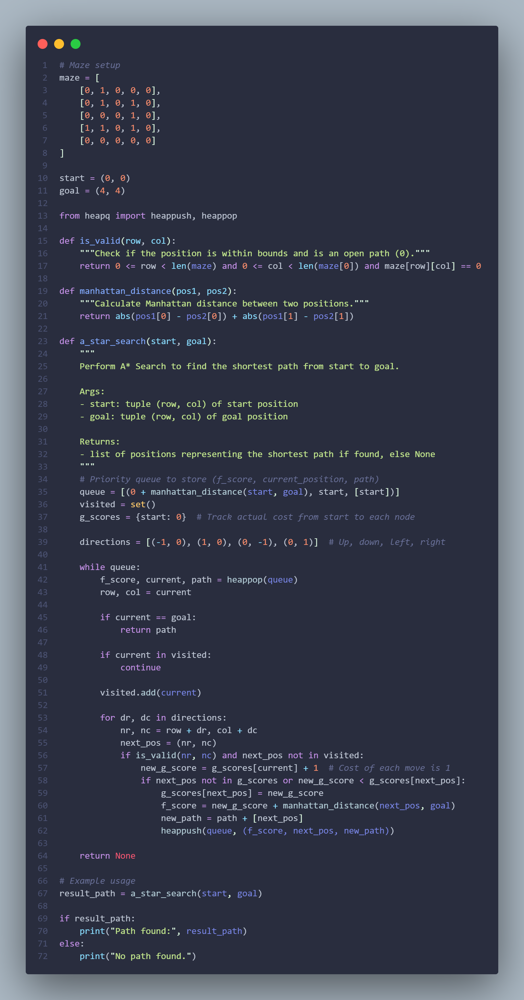

# 🧠 AI Search Algorithms — Python Implementations  
### 22 Classic Search, Optimization, and Game-Playing Algorithms  
A complete, practical reference for foundational Artificial Intelligence algorithms.

This repository contains **22 fully implemented AI algorithms** across search theory, optimization, constraint solving, and adversarial game-playing.  
Each algorithm includes a **clean Python implementation** + a **matching visual screenshot** demonstrating output behavior.

A strong showcase of AI fundamentals, algorithmic thinking, and Python coding.

---

# 📌 Overview

This repository includes comprehensive implementations of:

- Uninformed search  
- Informed + heuristic search  
- Optimization & local search  
- Constraint satisfaction problems (CSP)  
- Game-playing AI (Minimax + Alpha-Beta)  

Each script features:

✔ Readable Python code  
✔ Independent execution  
✔ Clear naming conventions  
✔ Matching screenshot illustrations  
✔ Lightweight logic focused on teaching fundamentals  

---

# 📂 Repository Structure

```
ai-search-algorithms/
│── algorithms/
│   ├── a_star.py
│   ├── uniform_cost_search.py
│   ├── best_first_search.py
│   ├── greedy_best_first_search.py
│   ├── bfs_dfs.py
│   ├── depth_limited_search.py
│   ├── branch_and_bound_dfs.py
│   ├── bidirectional_search.py
│   ├── tabu_search.py
│   ├── hill_climbing.py
│   ├── hill_climbing_random_restart.py
│   ├── simulated_annealing_nqueens.py
│   ├── beam_search.py
│   ├── iterative_deepening_dfs.py
│   ├── selective_deepening_search.py
│   ├── timetabling_csp.py
│   ├── csp_basic_impl.py
│   ├── minimax_tictactoe.py
│   ├── alphabeta_tictactoe.py
│   ├── tictactoe_cutoff_alphabeta.py
│   ├── tictactoe_quiescence_alphabeta.py
│   └── samuel_checkers.py
│
│── screenshots/
│   ├── A_Star.png
│   ├── Uniform_Cost-Search.png
│   ├── Best_First_Search.png
│   ├── BFS_and_DFS.png
│   ├── Beam_Search.png
│   ├── Depth-Limited_Search.png
│   ├── Depth-First_Branch_and_Bound.png
│   ├── Greedy_Best_First_Search.png
│   ├── Iterative_Deepening_DFS.png
│   ├── N-Queens_Simulated_Annealing.png
│   ├── Tabu_Search.png
│   ├── Samuel checker.png
│   ├── Selective_Deepening_Search.png
│   ├── Tic-Tac-Toe_with_Minimax.png
│   ├── Tic-Tac-Toe_with_cutoff_Search_and_Alpha-Beta_Pruning.png
│   ├── Tic-Tac-Toe Minmax_with_Alpha-Beta_Pruning_and_Quiescence_search.png
│   ├── minmaxwithalphabeta.png
│   ├── Timetabling_CSP.png
│   ├── Bidirectional_Search.png
│   ├── Hill_Climbing.png
│   ├── Hill_Climbing_with_Random_Walk_and_Restart.png
│   ├── CSP_with_Implements.png
│   └── Best_First_Search.png
│
└── README.md
```

---

# 🗂 List of Algorithms (Categorized + Explained)

## 🔍 Uninformed Search Algorithms

| Algorithm | Description |
|----------|-------------|
| Breadth-First Search (BFS) | Explores level-by-level; guarantees shortest path. |
| Depth-First Search (DFS) | Explores deepest nodes first; may get stuck. |
| Depth-Limited Search | DFS with maximum depth bound. |
| Iterative Deepening DFS (IDDFS) | Combines BFS optimality + DFS memory efficiency. |
| Uniform Cost Search | Expands least-cost node; optimal for weighted graphs. |
| Bidirectional Search | Runs forward & backward search simultaneously. |

---

## 🔥 Informed / Heuristic Search

| Algorithm | Description |
|----------|-------------|
| A* Search | Optimal with admissible heuristics: f(n)=g(n)+h(n). |
| Greedy Best-First Search | Expands smallest heuristic value. |
| Best-First Search | Heuristic-driven prioritized expansion. |
| Beam Search | BFS variant with limited frontier size. |
| Branch & Bound | DFS version that prunes nodes above best cost. |

---

## 🎯 Local Search / Optimization

| Algorithm | Description |
|----------|-------------|
| Hill Climbing | Greedy local improvement search. |
| Hill Climbing with Random Restart | Escapes local maxima. |
| Random Walk HC | Adds randomness to movement. |
| Simulated Annealing | Accepts worse moves early; global optimum friendly. |
| Tabu Search | Uses tabu list to avoid revisiting states. |

---

## 🧩 Constraint Satisfaction Problems (CSP)

| Algorithm | Description |
|----------|-------------|
| Timetabling CSP | Scheduling using constraints (slots, teachers, subjects). |
| Backtracking + Heuristics CSP | Applies MRV, LCV, AC-3 style pruning. |

---

## 🎮 Game-Playing Algorithms

| Algorithm | Description |
|----------|-------------|
| Minimax | Full game tree search for optimal play. |
| Alpha-Beta Pruning | Prunes useless branches to speed up minimax. |
| Alpha-Beta + Cutoff | Depth-limited search for efficiency. |
| Quiescence Search | Avoids horizon effect by extending unstable states. |
| Samuel’s Checkers | Classic learning-based heuristic agent. |

---

# 🖼 Screenshots

Screenshots for every algorithm are found in the `/screenshots` folder.

Example:

```
screenshots/A_Star.png
```

To embed:

```markdown

```

---

# ▶️ How to Run

Run any algorithm directly:

```bash
python algorithms/a_star.py
```

Scripts requiring input include prompts or instructions in the header.

---

# 🎯 Learning Outcomes

By exploring this repository, you gain strong understanding of:

- Problem formulation in AI search  
- Heuristic design (admissible & consistent)  
- Local vs global optimization  
- Constraint reasoning  
- Minimax decision-making  
- Alpha-beta pruning  
- Pythonic implementation of classical AI concepts  

Perfect for:

- AI fundamentals study  
- Interviews  
- Competitive programming  
- University AI/DS courses  
- ML/AI portfolio enhancement  

---

# 📘 Future Additions

- Genetic Algorithms  
- Particle Swarm Optimization (PSO)  
- Ant Colony Optimization (ACO)  
- Monte Carlo Tree Search (MCTS)  
- Basic Reinforcement Learning  
- Interactive pathfinding visualizer  

---

# 🏁 Summary

This repository provides a **complete reference collection** for classical AI algorithms including:

- Search  
- Heuristics  
- Optimization  
- CSP  
- Game AI  

Clean implementations + visual outputs make it an excellent learning and portfolio resource.

---

# 📬 Contact

**Arnav Saxena**  
AI/ML • Search Algorithms • Python • Problem Solving  
📧 Email: **arnav12saxena@gmail.com**  
🔗 LinkedIn: **https://www.linkedin.com/in/arnav-saxena-a9a217367**
